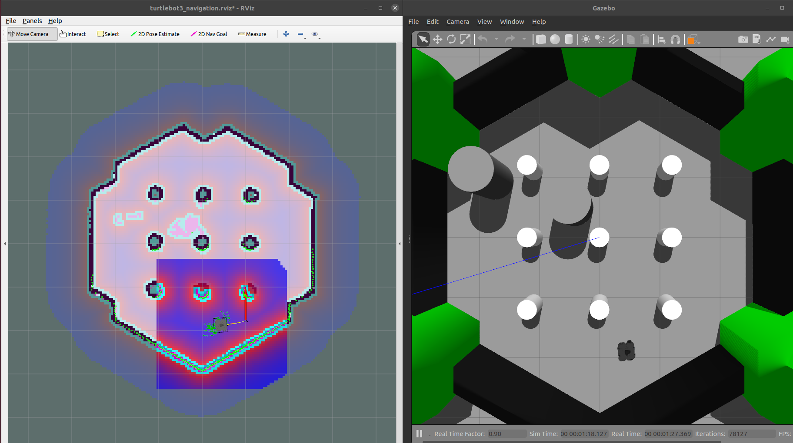

# TurtleBot3 Move_base Demo using ROS

This is a repository to demonstrate the use of Turtlebot3 with the move_base framework. Gazebo/Rviz are used for visualization.

## Prerequisites

This is a ROS package that depends on the following:
- [Turtlebot3 package](https://github.com/ROBOTIS-GIT/turtlebot3)
- [Turtlebot3_simulation package](https://github.com/ROBOTIS-GIT/turtlebot3_simulations)
- Rospy
- Numpy

Please ensure the presence and installation of the above prior to installing this package.
NOTE: This package was made and tested in ROS Noetic.

## Installation

1. Clone this repo to your `catkin_ws/src`

2. `cd catkin_ws` then `catkin_make`

3. `chmod +x catkin_ws/src/turtlebot3_move_base_demo/scripts/*.py `

4. You might need to change the shebang line in the python scripts to match your used python interpreter.

## Usage

Run the demo as follows:

`roslaunch turtlebot3_move_base_demo demo.launch`

To run the demo with dynamic obstacles, add the `add_obstacles` argument

`roslaunch turtlebot3_move_base_demo demo.launch add_obstacles:=true`

RGBD camera observations can also be recorded (e.g. for constructing deep learning datasets), by adding the `record_rgbd` flag:

`roslaunch turtlebot3_move_base_demo demo.launch add_obstacles:=true record_rgbd:=true` 